# vault-cast

## 요구사항 분석 및 정의

### 개요

#### 프로젝트 목적

VaultCast는 사용자가 동영상 파일을 업로드하고 그 동영상을 안전하게 스트리밍할 수 있도록 설계된 고성능 미디어 스트리밍 플랫폼입니다. 본 프로젝트는 다음의 핵심 목표를 달성하는 것을 목적으로 합니다.

1. 보안성 강화: 모든 통신에 대해 SSL/TLS를 적용하고 제로 트러스트 환경을 구축하여 무단 접근 및 데이터 유출을 방지합니다.
2. 확장성 및 고가용성: Docker 기반의 컨테이너화와 API Gateway(Spring Cloud Gateway 등)를 이용해 다수의 사용자가 동시에 접속해도 안정적으로 동영상을 제공할 수 있도록 설계합니다.
3. 최적의 스트리밍 성능: HTTP Range 요청 및 적응형 스트리밍 기법을 활용하여 동영상 재생의 신속한 시작 및 원활한 시청 경험을 보장합니다.

#### 주요 기술 스택

- 언어 및 프레임워크: Kotlin, Spring Boot(필요 시 Spring Cloud Gateway 포함)
- 컨테이너화: Docker(Docker Compose를 통한 다중 컨테이너 관리)
- 보안: SSL/TLS, 제로 트러스트 접근 방식, 인증서 관리 시스템
- 테스트: JUnit, Mockk, 부하 테스트 도구(예: Gatling, JMeter)

### 요구사항

VaultCast 프로젝트의 요구사항은 기능적 요구사항와 비기능적 요구사항 두 가지 범주로 나누고 구체적으로 정의합니다.

#### 기능적 요구사항

1. 동영상 업로드
    - 파일 검증 및 메타데이터
        - 파일 형식(예: mp4, mkv 등)과 파일 크기 제한 검증
        - 사용자가 입력한 메타데이터(제목, 설명, 태그 등)의 유효성 검사
    - 비동기 처리
        - 대용량 파일 및 네트워크 불안정 상황에 대비해 업로드 작업을 비동기/청크 방식으로 처리하는 기능 고려
    - 저장소 연동
        - 초기에는 로컬 파일 시스템 또는 임시 스토리지 사용
        - 추후 AWS S3, MinIO 등 분산형 스토리지로 확장 가능성 고려
2. 동영상 스트리밍
    - HTTP Range 요청 지원
        - 클라이언트가 특정 바이트 범위에 대해 요청할 수 있도록 Range 헤더 파싱
        - 동영상 파일의 특정 부분만 전송하여 재생 시작 시간 단축
    - Adaptive Streaming 준비
        - 초기 버전에서는 단일 비트레이트 전송 구현
        - 추후 HLS 또는 DASH와 같은 적응형 스트리밍 프로토콜 지원을 위한 기본 설계 고려
3. 사용자 인터페이스 및 API 관리
    - RESTful API 설계
        - 업로드, 스트리밍, 파일 상태 조회, 메타데이터 관리 등의 다양한 API 제공
    - API Gateway 통합(옵션)
        - 모든 외부 요청을 중앙 집중식으로 관리(라우팅, 인증, 로깅)
        - 내부 서비스는 외부로부터 직접 노출되지 않도록 격리
4. 테스트 및 검증
    - 단위 테스트
        - 각 서비스 및 기능 모듈별 테스트 코드 작성(예: 파일 업로드 유효성 검사, Range 요청 동작 등)
    - 통합 테스트
        - 업로드부터 스트리밍까지 전체 플로우를 검증할 수 있는 End-to-End 테스트 코드 작성
    - 부하 테스트
        - 실제 동시 사용자 환경을 가정하여 동영상 업로드 및 스트리밍 시나리오를 테스트
        - 스크립트를 통한 자동화된 부하 테스트 실시

#### 비기능적 요구사항

1. 보안 요구사항
    - SSL/TLS 암호화
        - 모든 클라이언트-서버 및 서비스 간 통신은 SSL/TLS로 암호화
        - Spring Boot 또는 API Gateway 레벨에서 HTTPS 적용
    - 제로 트러스트 모델
        - 내부 네트워크 포함 모든 통신에 대해 상호 인증 및 접근 제어 적용
        - 서비스 간 mTLS(상호 SSL 인증) 고려
    - 인증 및 권한 부여
        - API Gateway에서 JWT 또는 OAuth2 기반의 토큰 인증 도입
        - 역할 기반 접근 제어(RBAC) 적용
2. 성능 및 확장성
    - 고성능 스트리밍
        - HTTP Range 지원을 통해 빠른 재생 시작 및 사용자의 재생 위치 지정 기능 구현
        - 초기 HTTP/1.1 기반 구현에서 추후 HTTP/2를 통한 멀티플렉싱 고려
    - 확장성
        - 서비스 모듈 분리(업로드, 스트리밍, 인증 등)를 통해 수평 확장 가능하도록 설계
        - Docker 기반 컨테이너화로 개발, 테스트, 배포 환경 동일하게 유지
    - 부하 처리
        - 수천 ~ 수만의 동시 사용자 요청을 지원할 수 있도록 네트워크 및 서버 리소스 최적화
        - 캐싱, CDN 연동 가능성 고려
3. 유지보수 및 운영
    - 로깅 및 모니터링
        - 각 서비스의 로그를 통합 관리(예: ELK 스택, Prometheus + Grafana)
        - 보안, 성능 관련 모니터링 및 알림 시스템 구축
    - 배포 및 CI/CD
        - Docker Compose 및 CI/CD 파이프라인(Jenkins, GitHub Actions 등)을 이용해 자동 배포, 테스트, 빌드 관리
    - 문서화
        - 코드, API 명세, 아키텍처 다이어그램, 운영 매뉴얼 등 전체 시스템 문서화
4. 사용자 경험 및 인터페이스
    - 응답 속도
        - 업로드 및 스트리밍 서비스의 응답 속도 최적화로 사용자 경험 개선
        - 프론트엔드 및 모바일 클라이언트와의 연동 시 원활한 데이터 전송 보장
    - 에러 처리
        - 예상치 못한 에러에 대한 상세 에러 메세지 전달 및 로그 기록
        - 사용자가 문제를 쉽게 인지하고 재시도할 수 있도록 설계

### 시스템 구성 요소 및 상호 작용

#### 시스템 아키텍처 다이어그램

```mermaid
flowchart TD

  %% Upload Process 서브그래프
  subgraph "Upload Process"
      U1["User(Upload Request)"]
      GW1["API Gateway(SSL/TLS 인증)"]
      US["Upload Service(파일 검증 및 저장 처리)"]
      FS[(File Storage / Database)]

      %% 플로우: 업로드
      U1 -->|HTTPS Upload Request| GW1
      GW1 -->|요청 전달 + 보안 검증| US
      US -->|파일, 메타데이터 검증| US
      US -->|파일 및 메타데이터 저장| FS
      FS -->|"저장 결과 (ID 등) 반환"| US
      US -->|업로드 완료 응답| GW1
      GW1 -->|업로드 완료 응답 전달| U1
  end

  %% Streaming Process 서브그래프
  subgraph "Streaming Process"
      U2["User(Streaming Request with HTTP Range)"]
      GW2["API Gateway(SSL/TLS 인증)"]
      SS["Streaming Service(Range 파싱 및 청크 요청)"]
      FS2[(File Storage / Database)]

      %% 플로우: 스트리밍
      U2 -->|HTTPS Streaming Request| GW2
      GW2 -->|요청 전달 + 보안 검증| SS
      SS -->|HTTP Range 파싱 후 요청| FS2
      FS2 -->|요청한 파일 청크 반환| SS
      SS -->|스트리밍 데이터 응답| GW2
      GW2 -->|스트리밍 데이터 전달| U2
  end
```

- Upload Process
    - User: 사용자가 업로드 요청을 HTTPS로 전송합니다.
    - API Gateway: SSL/TLS 암호화된 요청을 받고 보안 검증 후 업로드 서비스를 호출합니다.
    - Upload Service: 파일의 형식, 크기, 메타데이터 등 유효성을 검사하며 파일과 연관 데이터를 파일 저장소(DB)에 저장합니다.
    - File Storage / Database: 실제 파일과 메타데이터를 저장하고 결과(예, 동영상 ID)를 반환합니다. 이후 각 단계를 거쳐 최종적으로 사용자에게 업로드 완료 응답을 반환합니다.
- Streaming Process
    - User: 사용자가 HTTP Range 헤더와 함께 스트리밍 요청을 HTTPS로 전송합니다.
    - API Gateway: 요청을 받아 보안 검증 후 스트리밍 서비스를 호출합니다.
    - Streaming Service: 요청에 포함된 Range 헤더를 파싱하여 파일 저장소에 필요한 파일 청크를 요청합니다.
    - File Storage / Database: 요청받은 파일 청크 데이터를 스트리밍 서비스로 반환합니다. 최종적으로 스트리밍 서비스는 데이터를 API Gateway에 전달하고 API Gateway는 이를 사용자에게 전송합니다.

## 아키텍처 설계

### 모듈 및 서비스 구성

- 업로드 서비스
    - 사용자 파일 업로드를 처리하고 파일의 유효성 검증 및 저장소(로컬 또는 추후 분산 스토리지)로 전달
- 스트리밍 서비스
    - 업로드된 동영상 파일을 HTTP Range 요청 기반으로 스트리밍 처리
    - 재생 시작 시간을 빠르게 처리할 수 있도록 파일의 특정 구간만 읽어주는 기능 구현
- API Gateway(Spring Cloud Gateway 등)
    - 모든 외부 요청이 Gateway를 통해 들어오도록 하여 보안(SSL 종료, 인증)과 로드 밸런싱 역할을 수행
    - 각 서비스의 세부 구현은 내부 네트워크로 숨기고 외부와의 인터페이스만 노출

### 기술 스택 및 선택 이유

- Kotlin & Spring Boot
    - Kotlin을 사용하면 코드가 간결해지고 Null 안전성 등 모던한 기능을 활용할 수 있습니다.
    - Spring Boot의 자동 구성 기능으로 빠르게 REST API를 구현할 수 있고 다양한 라이브러리 지원을 받을 수 있습니다.
- Docker
    - Docker 컨테이너를 사용하면 로컬 개발, 테스트 및 배포 환경이 동일하게 구성되어 환경 차이로 인한 문제를 최소화할 수 있습니다.
- SSL/제로 트러스트
    - 모든 통신 채널을 암호화하여 보안을 강화하고 API Gateway를 통해 일관된 인증/권한 부여 정책을 적용합니다.
